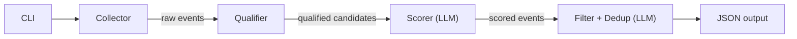

# Lead-Gen Agent

An autonomous AI agent that researches local events for a cookie business. Finds opportunities for popup booths and catering orders.

## Architecture



### 1) Collector (`src/stages/collector.ts`)

Broad search using SearXNG with high recall. Generates multiple query templates per keyword:
- Event intent: `{keyword} {city} events`
- Vendor intent: `{keyword} {city} vendor application`
- Community venues: `fairgrounds`, `chamber of commerce`, `city events calendar`

Also supports RSS/iCal feeds. Light deduplication by title+URL key.

### 2) Qualifier (`src/stages/qualifier.ts`)

Heuristic pre-filter with no LLM cost:
- **Hard rejects**: listing pages, directories, dictionaries, irrelevant domains
- **Signal scoring**: keywords like `vendor`, `application`, `booth`, `fair`, `festival`
- **URL boosts**: event-specific paths (`/e/`, `/event/`), vendor application URLs
- **Bare listing reject**: URLs ending in just `/events/` with no specific path

Emits `keptBecause` / `droppedBecause` for debugging. Caps candidates before scoring.

### 3) Scorer (`src/stages/scorer.ts`)

LLM-based scoring using Ollama (local) or OpenRouter (remote). Evaluates each event for cookie business potential across two revenue channels:

- **Popup booth**: events with foot traffic (markets, fairs, festivals, expos)
- **Catering**: large orders for organizations (corporate events, weddings, company parties)

Output schema per event:
- `name`, `eventType`, `location`, `date`, `estimatedAttendance`
- `score` (0-100), `reasoning`, `sourceUrl`

Date extraction from titles, descriptions, and URLs. Attendance estimation based on event type knowledge.

### 4) Post-Processing (`src/orchestrator.ts`)

After scoring, three filters run in sequence:

1. **Past-event filter**: Drops events with years before the current year (checks both `date` field and event name)
2. **URL pre-merge** (deterministic): Groups events sharing the same domain + URL path prefix (e.g., all `spanishfork.gov/events/fiestadays/*` pages merge)
3. **LLM dedup**: Sends remaining events (names, dates, locations, reasoning, URLs) to a model that groups semantically identical events across different domains

## Multi-City Scaling

Parallel execution with bounded concurrency:
- Env: `SEARCH_CITIES="City A;City B"` or CLI: `--cities`, `--cities-file`
- Per-city output: `output/events-YYYY-MM-DD-<city-slug>.json`
- Stage artifacts (optional): `output/stages/*-raw.json`, `output/stages/*-qualified.json`

## Infrastructure

| Component | Purpose | Setup |
|---|---|---|
| SearXNG | Self-hosted meta-search (unlimited, free) | `docker compose -f docker/docker-compose.yml up -d` |
| Ollama | Local LLM inference (no API costs) | `brew install ollama && ollama pull qwen2.5:14b` |
| Valkey | Redis-compatible cache for SearXNG | Included in Docker Compose |

## Configuration

| Variable | Default | Description |
|---|---|---|
| `SCORING_PROVIDER` | `ollama` | `ollama` or `openrouter` |
| `OLLAMA_MODEL` | `qwen2.5:14b` | Model for scoring |
| `OLLAMA_DEDUP_MODEL` | `qwen2.5:14b` | Model for LLM dedup |
| `OLLAMA_BASE_URL` | `http://localhost:11434` | Ollama API endpoint |
| `OPENROUTER_API_KEY` | — | Required only for OpenRouter |
| `OPENROUTER_MODEL` | `openrouter/hunter-alpha` | OpenRouter model |
| `SEARXNG_BASE_URL` | `http://localhost:8888` | SearXNG API endpoint |
| `SEARCH_LOCATION` | `Austin, TX` | Default single-city location |
| `SEARCH_CITIES` | — | Semicolon-separated multi-city list |
| `CITY_CONCURRENCY` | `4` | Max parallel city searches |
| `SEARCH_KEYWORDS` | see `.env.example` | Comma-separated search terms |
| `MAX_EVENTS_FOR_SCORING` | `20` | Max events sent to LLM scorer |
| `MIN_RELEVANCE_SCORE` | `40` | Post-scoring quality threshold |
| `QUALIFIER_MIN_SIGNAL_SCORE` | `2` | Heuristic qualifier threshold |
| `QUALIFIER_MAX_CANDIDATES` | `20` | Max candidates from qualifier |
| `WRITE_STAGE_ARTIFACTS` | `true` | Write raw/qualified debug files |

## CLI Usage

```bash
# Single city
node dist/index.js --location "Spanish Fork, UT"

# Multi-city from file
node dist/index.js --cities-file cities.txt --concurrency 2

# Override model/provider
node dist/index.js --provider openrouter --location "Provo, UT"
node dist/index.js --ollama-model llama3.1:8b --location "Provo, UT"

# Adjust thresholds
node dist/index.js --location "Provo, UT" --max-events 30 --min-score 50
```
